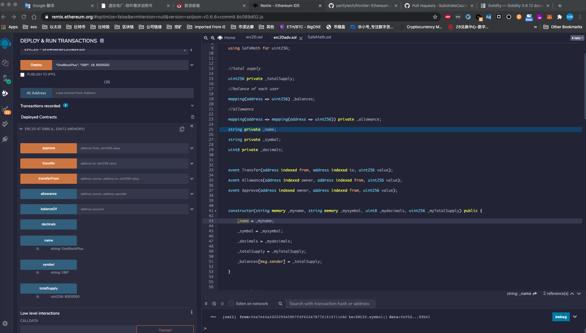
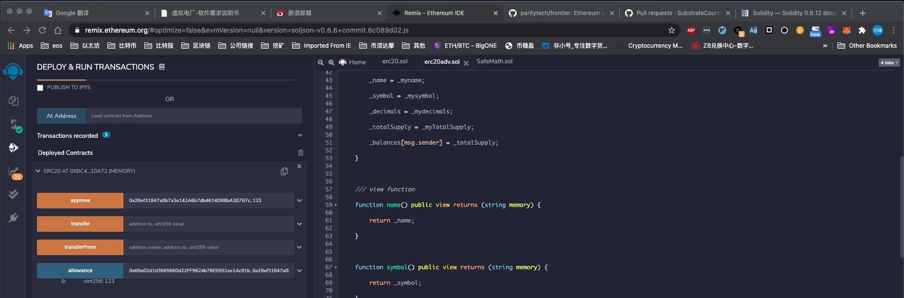

# Lesson11指令

## 操作账户

PrivateKey: `99B3C12287537E38C90A9219D4CB074A89A16E9CDB20BF85728EBD97C343E342`

Address: `0x6Be02d1d3665660d22FF9624b7BE0551ee1Ac91b`


## node启动

下载同路径下的`frontier.zip`文件到本地，并解压缩。

```bash
cd frontier
cargo build --release
```

启动节点：

```bash
cd frontier
./target/release/frontier-template-node purge-chain --dev
./target/release/frontier-template-node --dev
```

## 注意事项

gas limit: `4294967295`


##第11课作业

### 第1题
下载metamask, 打开remix.ethereum.org网站，连接到frontier node:
在remix中，自己写一个erc20的合约，并部署，初始化参数如(name: "OneBlockPlus", symbol: "OBP", decimals: 18, totalSupply: 8000000)作在remix中，点击totalSupply, name, symbol, totalSupply按钮并截图





### 第2题
执行approve方法，并点击allowance按钮，并截图

